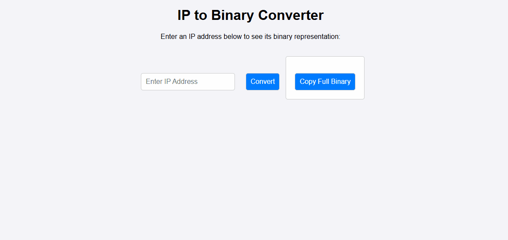

# 🌐 IP to Binary Converter

  

---

## 📌 Overview

The IP to Binary Converter is a lightweight web-based tool that converts IPv4 addresses into their binary equivalents.

It is designed to help learners and developers understand how IP addressing works at the binary level in a simple, interactive way.

---

## 🎬 Demo

The GIF above demonstrates real-time IPv4 → binary conversion.

---

## ✨ Features

- IPv4 → Binary conversion (8-bit per octet)
- Copy full binary output or individual sections
- Input validation for correct IPv4 format
- Instant conversion results
- Clean and responsive UI

---

## 🚀 Usage

1. Open `IP-to-Binary-Converter.html` in your browser  
2. Enter an IPv4 address (example: 8.8.8.8)  
3. Click Convert  
4. Copy full or partial binary output  

---

## 📁 Project Structure

IP-to-Binary-Converter/
│
├── IP-to-Binary-Converter.html
├── style.css
├── script.js
├── README.md
└── ip-to-binary-demo.gif

---

## 🔮 Future Enhancements

- IPv6 support  
- Binary ↔ Decimal ↔ Hex toggle  
- Dark mode UI  
- Subnet calculator mode  

---

## 📜 License

This project is licensed under the MIT License.
